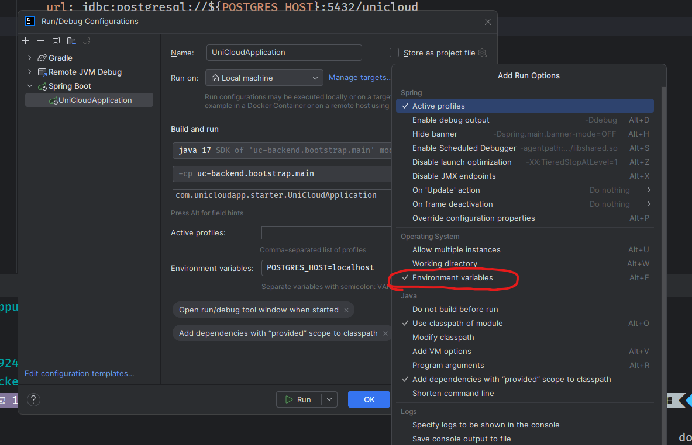
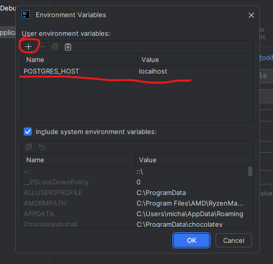

# uc-backend

## Running instruction
To run application from IntelliJ, you have to add environment variable. Just follow these steps:
1. Click Edit Configurations...

2. Enable Environment variables

3. Add environment variable named POSTGRES_HOST and value localhost

4. Just run/debug application

## Remote debugging
To debug application running as docker container, you have to follow these steps:
1. Click Edit Configurations...

2. Click Add New Configuration

3. Find Remote JVM Debug

4. Name your configuration, leave default options and hit Apply

5. Just click debug and enjoy debugging :)