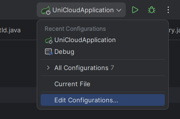
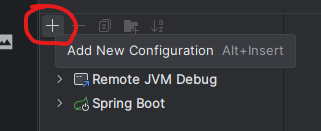
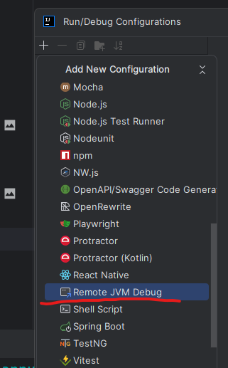
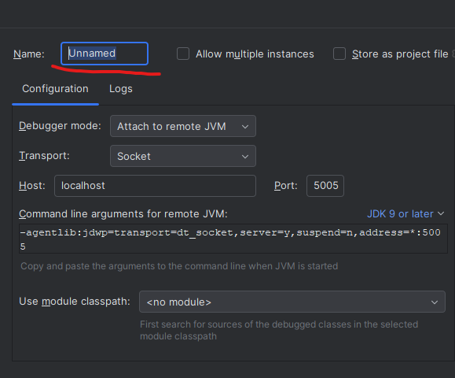
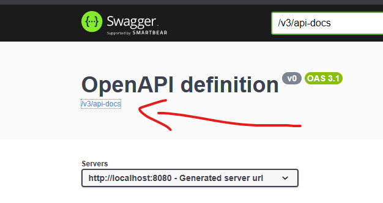
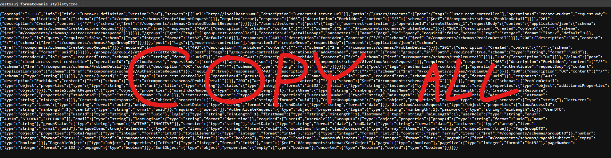
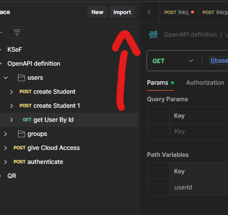
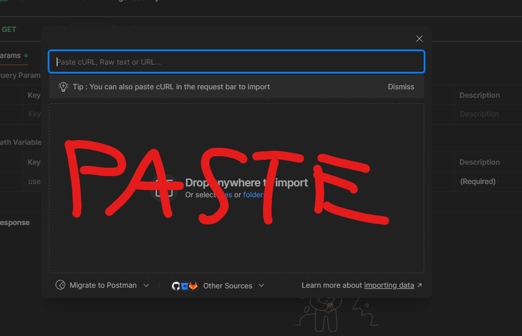

# uc-backend

## Remote debugging
To debug application running as docker container, you have to follow these steps:
1. Click Edit Configurations...
    
    

2. Click Add New Configuration

    

3. Find Remote JVM Debug

    

4. Name your configuration, leave default options and hit Apply

    

5. Just click debug and enjoy debugging :)

## Importing postman collection
1. Go to localhost:8080/swagger-ui/index.html
    
2. Copy all
   
3. Open Postman and click import
   
4. Paste copied text
   